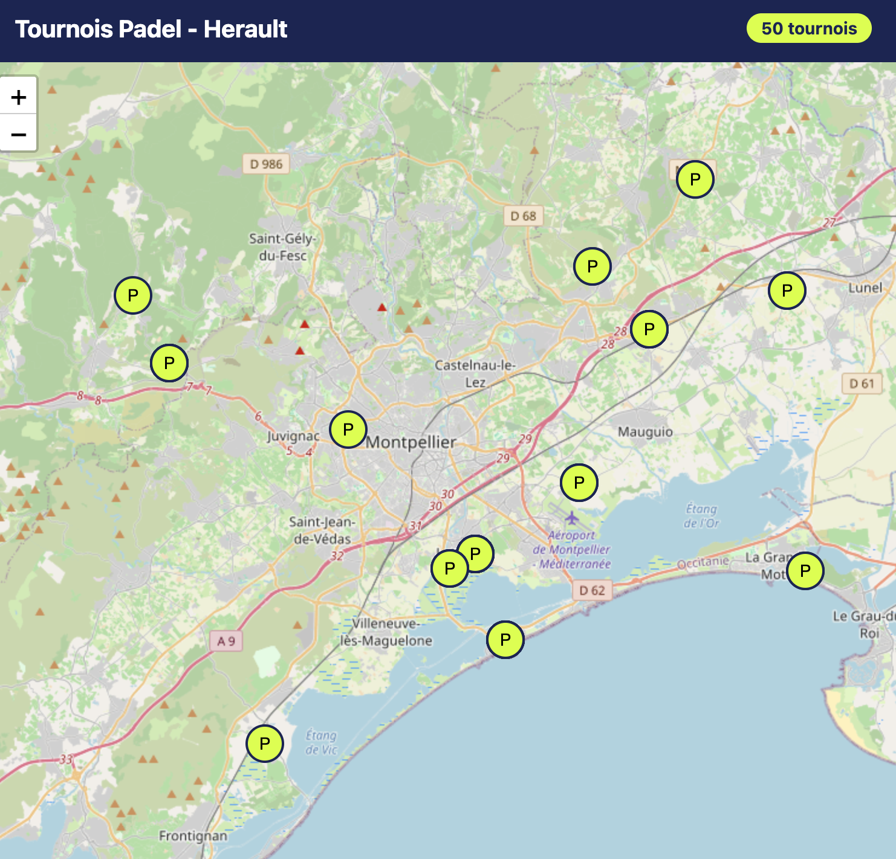

# 🎾 Padel Tournois — Carte Interactive

Une carte interactive qui agrège tous les tournois de padel homologués FFT autour de Montpellier, depuis Ten'Up.

## ✨ Aperçu



L'utilisateur peut visualiser sur une carte tous les tournois de padel à proximité, avec les informations essentielles :
- Catégorie (P25, P50, P100, P250, P500, P1000)
- Dates du tournoi
- Club organisateur
- Juge-arbitre
- Coordonnées de contact

## 🛠️ Stack technique

- **Python 3.12** — langage principal
- **Playwright** — scraping web (avec contournement de protection anti-bot)
- **pdfplumber** — extraction de données depuis PDF
- **API Adresse data.gouv.fr** — géocodage gratuit des adresses françaises
- **Leaflet + OpenStreetMap** — carte interactive
- **BeautifulSoup4** — parsing HTML

## 📊 Pipeline de données
## 🚀 Comment lancer

### Prérequis
- Python 3.12+
- macOS / Linux (testé sur macOS)

### Installation

```bash
# Cloner le projet
git clone https://github.com/camillethibault95/padel-app.git
cd padel-app

# Environnement virtuel
python3 -m venv venv
source venv/bin/activate

# Dépendances
pip install requests beautifulsoup4 playwright pdfplumber
playwright install chromium
```

### Utilisation

Pipeline complet en une commande :

```bash
python update_all.py
```

Cela va :
1. Télécharger le PDF des tournois depuis Ten'Up
2. Extraire et structurer les données
3. Géocoder chaque adresse
4. Générer la carte HTML
5. Ouvrir la carte dans le navigateur

## 📁 Architecture

| Fichier | Rôle |
|---------|------|
| `download.py` | Scraper Playwright qui télécharge le PDF Ten'Up |
| `clean_and_geocode.py` | Parsing du PDF + géocodage des adresses |
| `generer_carte.py` | Génère la carte interactive Leaflet |
| `update_all.py` | Pipeline complet (orchestrateur) |

## 🎯 Roadmap

- [ ] Filtres sur la carte (par catégorie, dates, genre)
- [ ] Géolocalisation utilisateur ("tournois autour de moi")
- [ ] Élargissement à plusieurs villes
- [ ] Mise en ligne (Vercel)
- [ ] Notifications par email pour les nouveaux tournois
- [ ] PWA installable sur mobile

## 📝 Notes

Ce projet est un projet personnel d'apprentissage. Les données proviennent de Ten'Up (FFT) et sont uniquement utilisées pour faciliter la découverte des tournois homologués.

## 👤 Auteure

**Camille Thibault** — [GitHub](https://github.com/camillethibault95)
